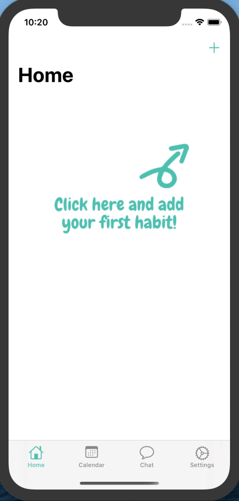
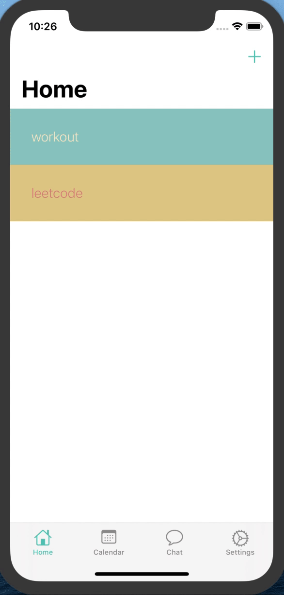
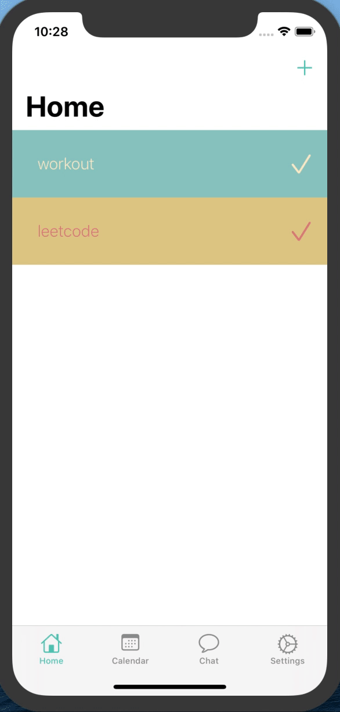
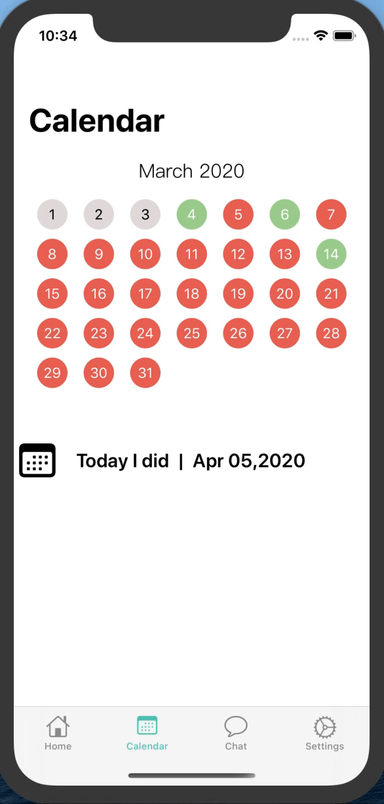
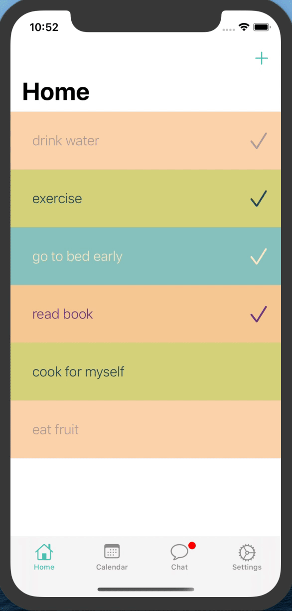
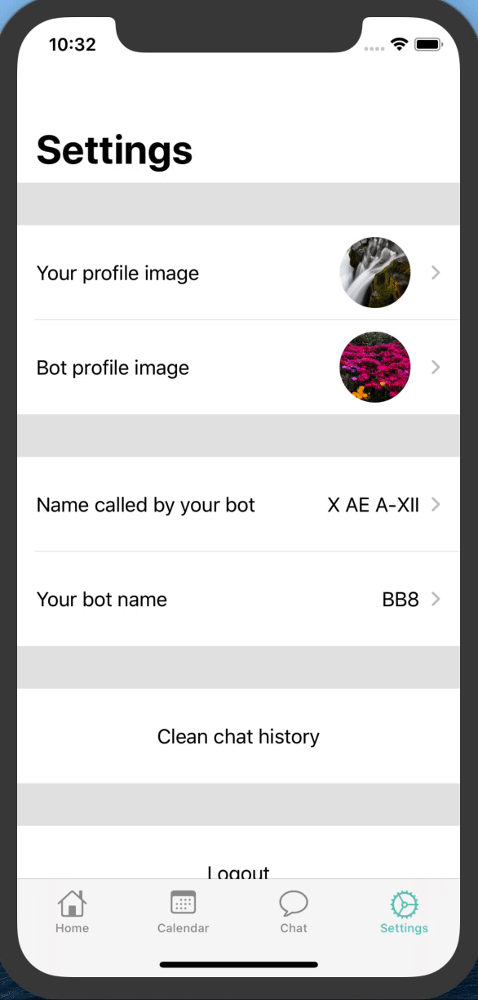

# Todoo

An iOS habit tracker using swift 5 and Google firebase. In addition to adding/modifying/removing habits and checking the detailed information about each habit, a virtual chat function was added. Users can personalize the robot's profile image and name, and whenever a habit is checked, the robot will encourage the user in the chat tab. Currently, all the encouragement messages are hardcoded but it can be easily modified to using some AI interface.

# Usage

Replace GoogleService-Info.plist in ./Todoo/Todoo with your own file (you can follow [this link](https://firebase.google.com/docs/ios/setup), then build with XCode.

# Requirements

- XCode 11.0+

- iOS 13.0+

# Demo

The login and register page uses Login Critter and you can find it [here](https://github.com/cgoldsby/LoginCritter).

Register

Add a new habit

Mark a habit done✅

Check habit detail

  
   

Undo and delete a habit

Change profile image and username

  
   

